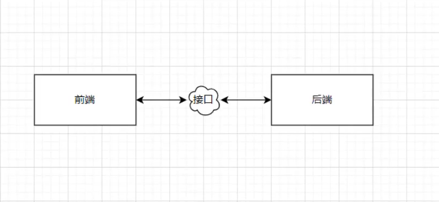
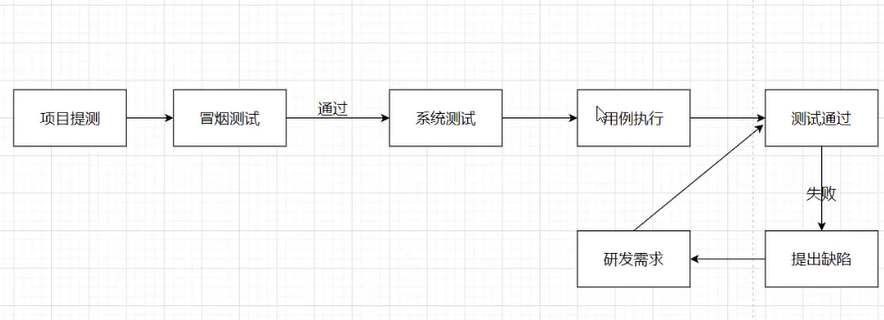
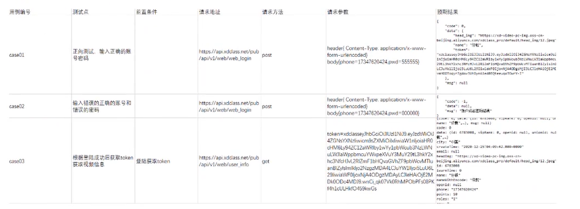
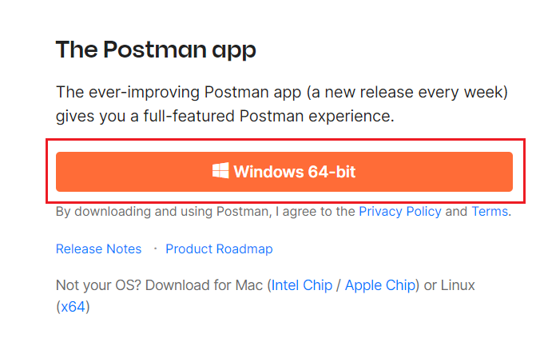
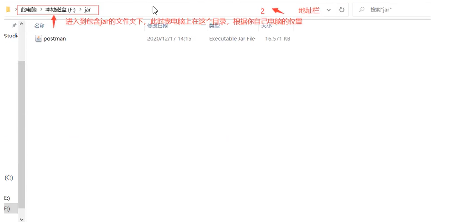
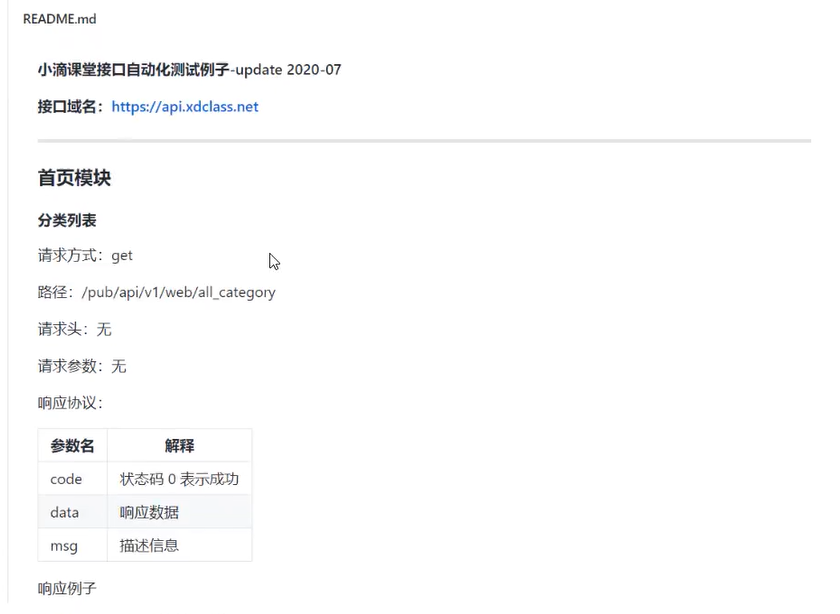
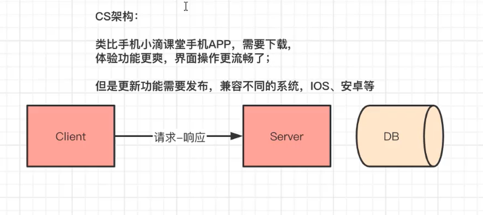

### 第一章 带你玩转postman工具

#### 第1集：postman实战课程介绍

**简介：介绍实战课程以及课程适合人员和学后水平**

- 课程退出原因
  1. 前端工程师要对拿到的接口文档简单做一下接口验证，看一下返回接口数据格式。在这个时候利用postman是一个比较好的选择。
  2. 后端工程师在对自己写的接口进行逻辑验证的时候，也需要自己发送请求进行测试。
  3. 测试工程师也要做各种接口类型的测试。
  4. 小白零基础学习测试。
- 学后水平
  1. 将对http协议有一个详细系统的认知。
  2. 将对postman这个工具有一个清晰系统的了解。
  3. 将学会多种预处理脚本和断言的操作。
  4. 将能使用runner加外部文件对整个集合进行统一测试。
- 课程涉及到的其他的知识点
  1. http
  2. json
  3. 如何运行一个jar包应用程序
- 适合人员
  - 前端、后端、零基础入门测试的同学
- 学习形式
  - 录播视频讲解 + 文字笔记

#### 第2集：postman实战课程目录大纲

**简介：课程大纲快速浏览**

- 学前基础
  - 对于前端或者后端同学，学习起来没有压力。
  - 如果你是零基础，你需要具备基础的JavaScript语法只是。
- 课程大纲目录介绍

#### 第3集：企业开发主流轻量级的数据交换格式json讲解

**简介：讲解json格式的基础知识**

- 什么是JSON

  JSON(JavaScript Object Notation) 是一种轻量级的数据交换格式。

  好处：

  1. 简介和清晰的层次结构使得 JSON 成为理想的数据交换语言。
  2. 易于人阅读和编写，同时易于机器解析和生成，并有效地提升网络传输效率。
  3. JSON独立于语言和平台，JSON解析器和JSON库支持许多不同的变成语言。

- JSON书写语法：

  - 花括号保存对象: `{"key" : "value"}`
  - 花括号保存数组：值类型
    1. 数字：整数或浮点数
    2. 字符串：在双引号中
    3. 逻辑值：true 或 false
    4. 数组：在方括号中
    5. 对象：在花括号中
    6. null

  

- 定义一个student的json对象

- 定义一个班级class的json对象

- 什么是json字符串：

#### 第4集：补充http相关知识

**简介：本章节主要提前补充http和https的只是**

- 什么是http呢？
  - http它是在互联网中的一种传输协议，它的全称叫超文本传输协议。
- http和https的关系
  - https相比http，信息在网络上传输更安全。https它是在http的基础上对传输的信息进行了加密的处理。

#### 第5集：基础理论-接口

**简介：本章节主要给大家讲解接口的概念**

接口的概念：我们可以将接口理解为是不同操作之间顺利交互的标准。

程序中的接口：




#### 第6集：什么是接口测试

**简介：接口测试**

1. 为什么要学习接口测试？

   当前开发很多都是前后端分离的，前后端的数据交互很多都是使用接口进行交互。

2. 什么是接口测试？

   接口测试就是针对软件对外提供的服务接口的输入输出进行测试，以及接口间相互逻辑的测试，验证接口功能与接口文档所描述的是否一致。

3. 接口测试的工作原理？

   接口测试就是基于某种协议模拟客户端向服务器发送请求。(我们工作中经常用的协议是http/https，但是不排除使用其他协议，使用其他协议测试的原理还是一样。)

4. 接口测试测试点？

   - 测试请求：测试请求地址是否正确，请求是否正常通过。
   - 测试数据：判断接口返回的数据是否和预期的一样。
   - 测试安全：有些接口不是暴露出来的，我们需要先验证才可以测试。
   - 测试性能：例如，某一个接口在同一时间上药有恩多的用户同时访问(比如双十一)。

5. 接口测试的必要条件？

   - 请求地址
   - 请求协议
   - 请求方式
   - 请求头
   - 请求参数

#### 第7集：测试执行过程

**简介：简单讲解一下测试执行过程**

冒烟测试：在对一个新版本进行系统大规模地测试之前，先验证一下软件基本功能是否实现，是否具备可测性。



#### 第8集：什么是测试用例

**简介：讲解一下测试用例**

测试用例标准概念：测试用例是通过使用在测试计划中确定的测试技术，对于已确定的测试条件进行逐步推敲，精炼而设计出来的重点说明，具体操作产生何种结果的文档。

编写测试用例的前提条件或者要求：测试用例应该具有可重复性、可验证性和需求可追踪性。

测试用例设计包括以下关键点：

1. 前提条件
2. 测试步骤
3. 测试数据
4. 预期结果

#### 第9集：测试用例实战设计

**简介：教大家如何写一个测试用例**



编写测试用例的思路：

### 第二章 带你认识优秀的测试工具 - postman

#### 第1集：手把手带你安装postman

**简介：简单介绍一下postman安装**

- 什么是postman：是一款非常流行的http接口测试工具

- postman有几种安装方式

  - 有两种安装方式，分别为应用程序和浏览器插件

  - postman下载：https://www.postman.com/download

    

  - chrome app 与 native app 的区别：

    1. cookies native 版本可以直接操作cookie，而Chrome版本需要安装扩展。
    2. 代理native版本自带proxy，可以用来抓包。
    3. menu bar
    4. postman console

  - 测试接口：https://xdclass.net

#### 第2集：使用postman不迷路 - 工具页面详解

**简介：对postman面板认识**

- 把postman面板划分为四个区域：

  - 上边工具栏

  - 左边工具栏

  - 右边工具栏

  - 下边工具栏

    

  

- 

#### 第3集：学习前的环境搭建 - jdk的安装

**简介：讲解安装jdk以及jdk的环境配置**

- jdk的简介
  - ire: java runtime environment
  - jdk: java development kit
- win10怎么配置jdk变量
  - 右键此电脑 -》属性 -》高级系统设置 -》环境变量
- jdk默认安装路径
- 新建两个变量
  - JAVA_HOME
    - 变量值为jdk的安装路径
  - PATH
    - %JAVA_HOME%bin
    - %JAVA_HOME%/jre/bin
- 测试环境是否安装成功
  - javac
  - java-version

#### 第4集：学习前的准备 - 运行jar包

**简介：讲解如何运行后端工程师打包好的jar包文件**

- jar包是什么呢？

  - 你就简单理解jar是一系列的压缩操作得到的可运行的java压缩文件

- 运行jar包的条件？

  - java运行环境，也就是上节课安装好配置好的jdk环境

- 运行步骤

  进入含有jar的文件夹下，然后在地址栏输入 -》cmd -》然后回车 -》java-jar postman.jar

  

- 测试是否可以正常使用

  - 在浏览器中，输入：`localhost:8085/pub/api/test`

#### 第5集：接口文档简单讲解

**简介：对接口文档讲解**

- 前端、测试拿到接口文档如何做

  - https://github.com/jackxy/api_auto_test
  - 

- 本次课程中的jar包中参数简单讲解

  **get模块**

  1. get无参

     请求方式：get

     路径：xdclass.net

     请求头：无

     请求参数：无

     响应协议：

     | 参数名 | 解释              |
     | ------ | ----------------- |
     | code   | 状态码 0 表示成功 |
     | data   | 相应数据          |
     | msg    | 描述信息          |

     

  2. get有参

     请求方式：get

     路径：`localhost:8085/pub/api/date`

     请求头：无

     请求参数：

     | 参数名 | 解释                         |
     | ------ | ---------------------------- |
     | key    | 可不选，可选值为(时、分、秒) |

- 运行jar包注意事项：jar不能重复运行

### 第三章 软件测试必备核心知识之http协议

#### 第1集：B/S架构和C/S架构你知道多少

- 什么是C/S架构：客户机-服务器，即Client-Server(C/S)结构，但是缺少通用性，系统维护、升级需要重新设计和开发，增加了维护和管理的难度。

- 什么是B/S架构：B/S架构即浏览器和服务器架构模式，是WEB兴起后的一种网络架构模式 WEB 浏览器是客户端最主要的应用软件，统一了客户端，将系统功能实现的核心部分几种到服务器上，简化了系统的开发、维护和使用。

  

- 什么是URL(统一资源定位符，获取服务器资源的一种)

  标准格式：协议://服务器IP:端口/路径1/路径N? key1 = value1 & key2 = value2

  - 协议：不同的协议有不同的解析方式
  - 服务器ip/域名：网络中存在无数的主机，要访问的哪一台，通过公网ip区分
  - 端口：一台主机上运行着很多的进程，为了区分不同的进程，一个端口对应一个进程，http默认的端口是80
  - 路径：资源N多种，为了更进一步区分资源所在的路径(后端接口，一般称为“接口路径”，“接口”)

#### 第2集：什么是Hyper Text Transfer Protocol 

**简介：什么是http超文本传输协议**

- 协议

  - 协议是一种约定，规定要一种信息的格式，如果发送方式按照这种请求格式发送信息，那么接收端就要按照这样的格式解析数据，这就是协议。

  - json协议

    ```json
    {
        "name":"jack",
        "age":23
    }
    ```

    

  - xml协议

    ```xml
    <user>
    	<name> jack </name>
        <age> 234 </age>
    </user>
    ```

    

  - http超文本传输协议

- 什么是http协议

  - 即超文本传输协议(Hyper Text Transfer Protocol)，是Web联网的基础，也是手机PC联网常用的协议之一，HTTP是建立在TCP协议之上的一种应用。
  - 

- 

#### 第3集：超文本传输协议http消息体拆分讲解

**简介：**

#### 第4集：http的九种请求方式介绍

**简介：**

#### 第5集：http常见响应状态码httpcode

**简介：**

#### 第6集：http请求头知识点讲解

**简介：**

#### 第7集：http响应头知识点讲解

**简介：**

#### 第8集：http常见请求/响应头content-type内容类型讲解

**简介：**

### 第四章 在实战中帮你学习postman

#### 第1集：

**简介：**
