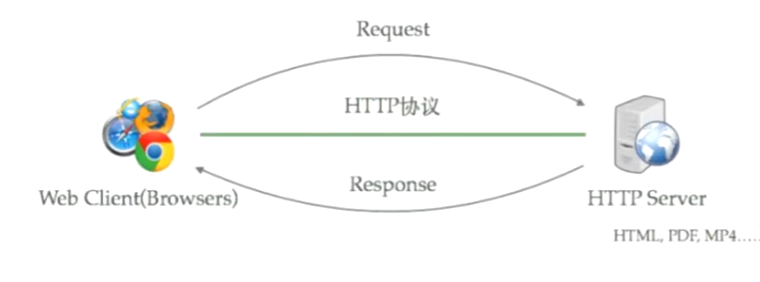

### 初始Fiddler，深入理解HTTP

#### Fiddler简介

[视频地址](https://www.bilibili.com/video/BV1c4411c7zH?spm_id_from=333.999.0.0)

fiddler字面意思：1. 拉小提琴的人。2. 骗子。

1. Fiddler 是位于客户端和服务端的HTTP代理。

2. 目前最常用的http抓包工具之一。

3. 功能非常强大，是web调试的利器：
   - 监控浏览器所有的HTTP/HTTPS流量(浏览器和服务器通信过程中)
   - 查看、分析请求内容细节
   - 伪造客户端和服务器响应
   - 测试网络的性能
   - 解密HTTPS的web会话
   - 全局、局部断点功能
   - 第三方插件

使用场景：

- 接口调试、接口测试、线上环境调试、web性能分析

#### 抓包原理

B/S架构：（Browser/Server，浏览器/伺服器模式），是WEB兴起后的一种网路结构模式，WEB浏览器是客户端最主要的套用软体。这种模式统一了客户端，将系统功能实现的核心部分集中到伺服器上，简化了系统的开发、维护和使用。客户机上只要安装一个浏览器，如Netscape Navigator或Internet Explorer，伺服器安装SQL Server、Oracle、MYSQL等资料库。浏览器通过Web Server 同资料库进行数据互动。

1. 编写程序部署到web服务器。

2. web服务器运行在服务器上，绑定ip地址并监听某端口，接收和处理http请求。

3. 客户端通过http协议获取服务器上的网页、文档等资源。

   

[柠檬班测试地址](http://test.lemonban.com/ningmengban/app/login/login.html)

柠檬班图片地址用来分析：http://test.lemonban.com/ningmengban/images/logo.png

- `http://`：协议名

- `test.lemonban.com`：域名，域名最终还是会转成IP地址。(域名是方便记忆，IP地址不好记忆)。

  如何通过`域名`找到对应的`IP地址`？

  1. 打开CMD。
  2. 输入命令：`ping test.lemonban.com`回车
  3. IP地址为：`8.129.91.152`

  

- 

#### HTTP协议详解

### Fiddler工具详解及应用实战

#### 请求分析

#### 请求修改

#### 响应修改

#### 网络限速

#### 断点调试

#### 设计请求

#### 自动响应

#### mock测试

### HTTPS及手机APP抓包

#### HTTPS抓包

#### APP抓包

