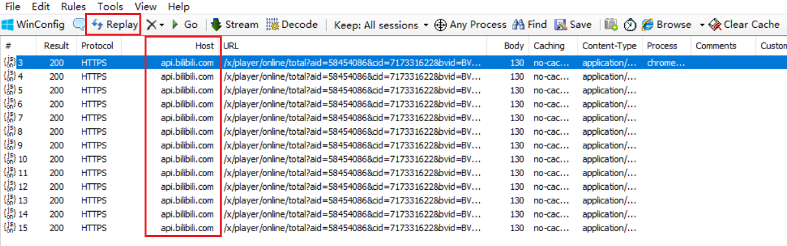
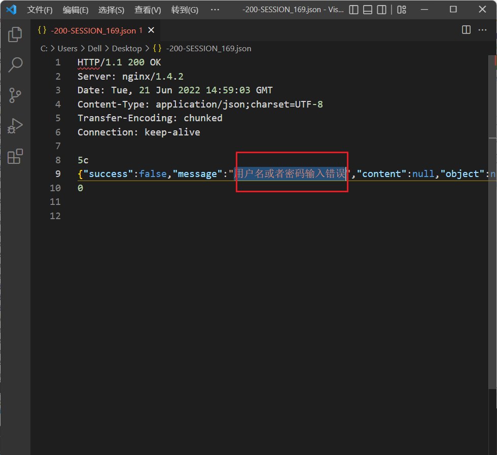
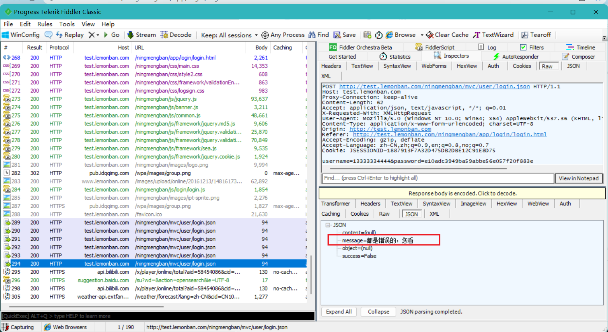

### 一、初始Fiddler，深入理解HTTP

#### Fiddler简介

[视频地址](https://www.bilibili.com/video/BV1c4411c7zH?spm_id_from=333.999.0.0)

fiddler字面意思：1. 拉小提琴的人。2. 骗子。

1. Fiddler 是位于客户端和服务端的HTTP代理。

2. 目前最常用的http抓包工具之一。

3. 功能非常强大，是web调试的利器：
   - 监控浏览器所有的HTTP/HTTPS流量(浏览器和服务器通信过程中)
   - 查看、分析请求内容细节
   - 伪造客户端和服务器响应
   - 测试网络的性能
   - 解密HTTPS的web会话
   - 全局、局部断点功能
   - 第三方插件

使用场景：

- 接口调试、接口测试、线上环境调试、web性能分析
- 判断前后端bug、开发环境hosts配置、mock、弱网断网测试

#### 抓包原理

B/S架构：（Browser/Server，浏览器/伺服器模式），是WEB兴起后的一种网路结构模式，WEB浏览器是客户端最主要的套用软体。这种模式统一了客户端，将系统功能实现的核心部分集中到伺服器上，简化了系统的开发、维护和使用。客户机上只要安装一个浏览器，如Netscape Navigator或Internet Explorer，伺服器安装SQL Server、Oracle、MYSQL等资料库。浏览器通过Web Server 同资料库进行数据互动。

1. 编写程序部署到web服务器。

2. web服务器运行在服务器上，绑定ip地址并监听某端口，接收和处理http请求。

3. 客户端通过http协议获取服务器上的网页、文档等资源。

   

[柠檬班测试地址](http://test.lemonban.com/ningmengban/app/login/login.html)

柠檬班图片地址用来分析：http://test.lemonban.com/ningmengban/images/logo.png

- `http://`：协议名

- `test.lemonban.com`：域名，域名最终还是会转成IP地址。(域名是方便记忆，IP地址不好记忆)。

  如何通过`域名`找到对应的`IP地址`？

  1. 打开CMD。
  2. 输入命令：`ping test.lemonban.com`回车
  3. IP地址为：`8.129.91.152`

  

**fiddler工作原理**

不管是客户端给服务器发请求，还是服务器给服务器响应，这个中间的过程fiddler都能够监听到。

**fiddler劫持原理**

fiddler直接代理的端口号`8888`

我们可以通过下面的方式验证：

打开fiddler的情况下

1. 找到谷歌浏览器的设置 --》高级--》系统--》打开您计算机的代理设置(点击一下)

   

2. 点击以后，我们可以看到当前电脑中的设置：这个端口也是`8888`

   

关闭fiddler的情况下

1. 找到谷歌浏览器的设置 --》高级--》系统--》打开您计算机的代理设置(点击一下)

   

2. 本机计算机，并不会被代理

   

#### HTTP协议详解

- HTTP：Hyper Text Transfer Protocal 超文本传输协议
- 用于从万维网服务器传输超文本到本地浏览器的传送协议
- HTTP协议是就TCP的应用层写协议，它不关心数据传输的细节，主要是用来`规定客户端和服务端的数据传输格式`，最初是用来向客户端传输HTML页面的内容。默认端口是80
- HTTP是基于请求与响应模式的、无状态的、应用层的协议

#### HTTP请求报文

http请求报文主要由**请求首行**、**请求头**、**请求空行**、**请求正文**(也叫请求体)4部分组成，请求体在get请求中是没有的。

##### HTTP请求方法

##### URL

##### 请求头

#### HTTP响应报文

##### 状态码

##### 响应头

### 二、Fiddler工具详解及应用实战

#### 界面介绍

#### 请求分析

#### 请求修改

#### 响应修改

#### 网络限速

#### 断点调试

#### 设计请求

#### 自动响应

#### mock测试

### 三、HTTPS及手机APP抓包

#### HTTPS抓包

#### APP抓包

### 四、fiddler快捷键

1. shift + delete：删除其他的请求(在内容中会请求到很多的结果，当你只想保留当前的结果的时候)

2. 到处请求内容：把某一条信息导入到一个文本文件中：右击--》save--》Selected Sessions –> as Text…

   

   请求和响应

   

3. 双击某一条就能得到请求和响应，在右边展示：

   

4. 双击某一条，右边都选raw，表示以原生文本的形式来查看：

   

5. 阻塞css请求：点击filter --》Block CSS files

   

   设置后的样子：css的样式都是404

   

   可以看这个网址：直接没有css样式了

   

6. 设置请求头：filter --》Set request header

   设置后，会出现在请求头中

   

   设置后的样子：

   

#### 菜单栏+部分工具条介绍

- 

   - WinConfig：配置Windows身上一定一些应用程序，需不需要抓到对应应用程序的包。这一个一般很少用，这可以不用管它。

     

   - 添加一个备注：你选择的这个会话，你可以添加一个备注。

     

     添加完，会在Comments中显示：

     

     用处就是可以导出这一条信息给你的开发人员去看，会出现这个comments的内容。实际上用得少。

   - replace：对选中这一条重新发送请求。要先选中，然后点击就会重新发送这一条的请求。

     

     - 这个操纵有一个快捷键：选中某一条 + R(大写)，可以实现replace的效果。
     - 如果是重新发送50次，快捷键：选中某一条，shift+R(大写)。作用：主要是对服务器的压力测试。

     

     

   - `叉叉介绍`：主要关于清除的

     

     1. Remove all：清除所有的会话。快捷键：ctrl + x
     2. Image：清除图片
     3. CONNECTs：清除 tunnel to 那种中间的连接请求
     4. Non-200s：Result：非200的清除掉
     5. Non-Browser：非浏览器的清除掉
     6. Complete & Unmarked：完成的 & 未被标记的清除掉(几乎不用)
     7. Duplicate response bodies：重复的响应体清除掉(几乎不用)

   - Go：是用在断点中间的

     

     使用：

     1. 点击下面的这个空白地方

        

     2. 点击后会出现一个`T`：表示在请求发送前会停下来，这个时候你就可以查看这个内容

        

     3. 点击GO：直接把请求发送出去了

        

     4. 注意点这个`T`不用了，要记得关掉，否则会影响其他的请求。

   - Stream：表示是一种流模式。流模式和浏览器实际的请求的模式是一样的，服务器返回什么内容，我就立马把返回的内容返回给客户端。(一般不用)

     

     除了流模式fiddler还默认支持一种缓冲模式：就是当服务器把所有的数据全部响应回来之后，fiddler接收完之后，再一次性转给前端。(默认是缓冲模式)

     使用缓冲模式我们可以打断点、伪造请求、伪造相应等。

   - Decode：解码：有一些内容从服务器发回来，它是会去做编码，会去做压缩的。如果想直接看到的话，要去解码

     

     下面这个会话就是需要解码：点击黄色的部分就能解码当前条，点击菜单上到Decode解码，表示解码请求回来的所有会话。

     

   - Keep：All sessions 保持会话的数量(一般不会去点击)。保存会话是需要占用内存的，根据实际情况来选择数量。

     

   - Any Process：表示你想要用它来抓取哪个app。

     

     使用：比如说只想让它抓取Google浏览器的信息

     1. 点击Any Process不松手

        

     2. 移动到谷歌浏览器上就可以了

        

   - Find：查找某一个会话。快捷键：ctrl + f

     
     
   - Save：保存。把所有的会话保存为一个叫做`.saz`后缀的文件

     
     
     
     
   - 倒计时：一个简单的计时器，并没有什么用

     

   - 快速的打开某个浏览器。没啥用：

     

   - Clear Cache：清除旁边选定的浏览器缓存

     

   - TextWizard：文本解析。能够进行一些简单的编码解码。

     

     可以转换成很多的类型：

     

   - Tearoff：分离面板。这个功能没什么用

     

     点击叉号，又会回到原来的样子

     

   - 搜索：一般不用

     

   - Online：本机的一些在线信息

     

     

8. View：是否展示/隐藏某写工具

   

9. 是否隐藏重定向：

   

10. ctrl + f：查找某一个会话

    

#### 会话列表介绍

- #：用于排序。如果你想后面抓的请求显示在前面，你点一下#就可以了

  

- 

- 

- Result：http status 状态码

  

- Protocol：协议名

  

- Host：主机名

  

- URL：统一资源定位符的路径

  

- Body：请求内容的大小，多少字节

  

- Caching：是否做了缓存

  

- Content-Type：内容类型。请求从服务器返回的内容类型是什么

  

- Process：进程

  

- Comments：添加备注

  

- Custom：自定义列(这个用得少)

  

- 比如说自定义一列

  1. 在Rules中找到CustomizeRules

     

  2. ctrl + f 搜索：static function Main()

     

  3. 添加一行代码：`FiddlerObject.UI.lvSessions.AddBoundColumn("ServerIP", 120, "X-HostIP");`，点击保存

     

  4. 添加成功。如果没有看到效果，可以退出程序，重启程序。

     

  5. 还可以自定义请求方式等，可以尝试

  

#### 命令行+状态栏

- 

- QuickExec：一整条黑色的这个

  

  输入help + 回车，会跳转到官方的帮助文档上。里面有很多很好的命令可以使用

  

- Capturing：表示处于代理功能。正在捕获会话中。。。

  

  点击一下Capturing就会消失，也就捕获不到会话了

  

- Web Browsers：表示只看浏览器的捕获

  

- 空白的地方：断点作用。

  

- 会话的个数

  

- 

#### 辅助标签+工具

- 

- 

- Statistics：选择某个会话，选择statistics：表示性能方面的一些统计，测试工程师不太关注，前端工程师会看这个请求的整体的性能分析

  

  Request Count：请求数量

  Bytes Sent: 发送了多少字节

  Bytes Received: 接收了多少字节

  (headers:2,417; body:383)：headers字节，body的字节

  ClientConnected：客户端连接时间

  DNS Lookup：DNS解析

  TCP/IP Connect:	TCP/IP的一个连接时间

  HTTPS Handshake:	HTTP3次握手花了多少时间

- Inspectors：检查器(很重要)。单击某条会话，然后选择检查器，就可以查看。

  Inspectors 主要是检查请求用的。

  

  请求我们都知道包括两个部分：请求报文和响应报文。

  fiddler中有非常多的形式来展示我们的请求报文和响应报文

  

  一般都是选择raw的形式

  

  Headers：只会显示Headers相关的内容

  

  WebFroms：以表单提交的方式查看：

  

  Cookie：如果有Cookie可以单独展示Cookie

  

  JSON：如果是JSON传输的，可以以JSON的格式查看。

  SyntaxView：一般不使用。

  Auth：一般不使用。

  HexView：以十六进制的方式查看，一般不使用。

- 自动响应器

  

  Enable rules没打钩：表示自动响应器还没有使用

  

  使用自动响应器将生产上的请求拦截下来，重定向我的本地或者指定的响应：做个例子：把柠檬班的图片换掉

  

  第一步：复制图片地址：

  

  第二步：在fiddler中添加一个规则：

  

  第三步：规则定制

  

  第四步：第二个框是内置响应

  

  第五步：点击save

  

  第六步：使用规则：勾选Enable rules

  

  第七步：打勾Unmatched requestspassthrough：放行一些没有匹配上的请求

  

  第八步：去缓存刷新(ctrl + shift + r)。可以看到图片不见了

  

  第九步：点击第二个框的下拉，找到 Find a file

  

  第十步：选择好图片，点击Save

  

  第十一步：刷新页面

  

  

- 重定向(用来做Mock，开发人员做模拟请求)：当进入登录页面的时候，让重定向到我自己的js文件

  1. 选择AutoResponder，给这两个地方打勾

     

  2. 选择一个会话，并且复制这里的内容

     

  3. 把复制的内容放入到桌面的js中

     

  4. 给桌面的js加入一行代码

     

  5. 按住要重定向的会话，拖入到这里面空白的地方

     

     拖入后的样子：

     

  6. 第二个框放桌面的`mylogin.js`，并点击 save 按钮。

     

  7. `ctrl + shift + r`重定向到桌面的js文件成功

     

- 做一个钓鱼网站的重定向：前面的步骤跟上面的重定向是一样的，就不重复了

  1. 修改刚才的`login.js`

     

  2. 做好和重定向一样的准备

     

  3. `ctrl + shift + r`重定向到桌面的js文件成功

     

  4. 选择`确定`：

     

  5. 选择`取消`：

     

- 如果后端接口没有写好，AutoResponder 可以用来做模拟数据

  1. 点击登录按钮，得到的结果是：

     

     默认的响应：

     

  2. 把要修改的会话拖过来：

     

  3. 右击==》选择 Edit File With

     

     选择vscode，点击确定：

     

  4. 修改内容：

     

     修改成：

     

     点击save：

     

  5. ctrl + shift + r，把页面刷新一次，再来看会话：

     

- Composer：设计者。用来设计请求的

  

  用来设计请求报文，最后执行 Execute：

  

  - 如：设计一个百度的请求，然后点击`Execute`，就会在会话里面多出来一条请求

  

  - 可以有很多方式来查看这个请求，我们也可以使用`WebView`的方式来查看：

    

    

- Fiddler Orchestra Beta：这是fiddler5新出来的一个功能，目前还是一个Beta版本，这个老师暂时也不知道怎么用

  

- Fiddler Script：对fiddler界面做一些调整。如：对会话中添加一列等等。一般不使用。

  

- Log：发请求相关的一些日志。用得很少。

  

- Filters：过滤器。很简单，但是很有用

  

  - 开启filter：打勾 Use Filters

    

  - 主机的过滤、进程的过滤、请求头的过滤

    

  - 断点的过滤、响应状态码的过滤、响应类型和大小的过滤

    

  - 主机过滤：局域网还是广域网。如果选择局域网(Show only Intranet Hosts)，那么广域网的内容就抓不到了。

    

  - 需求：只显示主机为`www.baidu.com`的会话

    1. 右击会话 ==》copy == 》这一列

    

    2. 选择filter ==》Show only the following Hosts

    

    3. 右击粘贴，把host粘贴进来

    

    4. 点击Actions ==》 Run Filterset Now

    

    5. 在网页的百度网上，刷新一下

    

    host都是www.baidu.com了

    

    

- 弱网测试

  点击Rules 下的 Performance 下的Simulate Modem Speeds

  

  它会每300ms返回1kb，速度非常慢。可以在Rules下的Customize Rules中查看

  

  

- 

